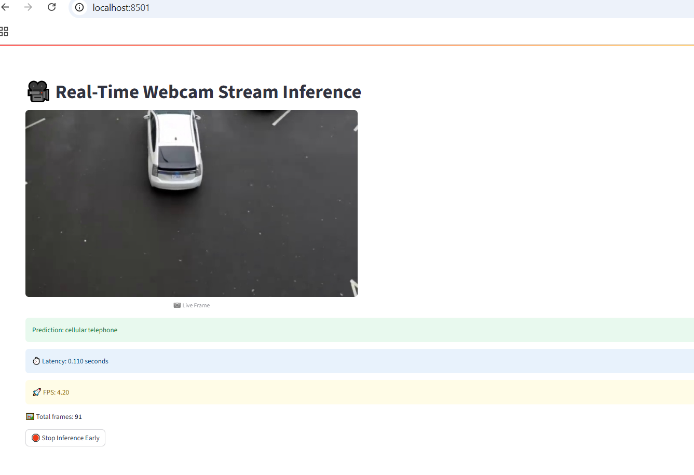

# Real-Time Image Classification System

A complete pipeline for real-time image classification using Kafka, gRPC and PyTorch (ResNet18) with ONNX optimization, containerized with Docker.

## System Architecture

[Webcam] -> [Kafka Producer] -> [Kafka Topic]
-> [Kafka Consumer] -> [Kafa Consumer] -> [gRPC Inference]


## Features

### Core Components
- **Kafka Producer**: Captures frames from webcam and publishes to Kafka topic
- **Streamlit Consumer**: Consumes frames, gets predictions, and displays results
- **Inference Service**: gRPC server with ONNX-optimized ResNet18 model


### Observability
- Health checks for all services (`/health`)
- Performance metrics endpoints (`/metrics`)
- Real-time dashboard with:
  - Classification results
  - Processing latency
  - System throughput (FPS)

## Prerequisites

- Docker
- Docker Compose
- Webcam (or video file for testing)

## Quick Start

1. **Build all services**:
```bash
docker-compose build --progress=plain
```

2. **Start Zoopkeeker and Kafka container**
```bash
docker-compose up -d zookeeper kafka
```

3. **Start Inference Service**
```bash
docker-compose up -d inference-service
```

4. **Start Kafka producer**
```bash
docker-compose up -d producer
```

4. **Start Kafka producer**
```bash
docker-compose up -d consumer
```

## Streamlit App

Access Streamlit Dashboard at this URL:

```bash
http://localhost:8501
```

  
*Streamlit dashboard showing real-time classification results*

## Health and Metrices of the Docker gPRC service

### Health Check are logged at

```bash
http://localhost:5000/health 

```

example format
```bash
json
{
  "status": "healthy",
  "optimization": "ONNX"
}
```

### Metrices are logged at
```bash
http://localhost:5000/metrics
```

example format
```bash
json
{
  "model": "resnet18",
  "optimization": "ONNX",
  "device": "cuda"
}
```

#### Logs:

```bash
text
2025-07-13 16:59:00,556 - __main__ - INFO - Inference completed in 46.99ms
2025-07-13 16:59:00,660 - __main__ - INFO - Inference completed in 53.76ms
```
